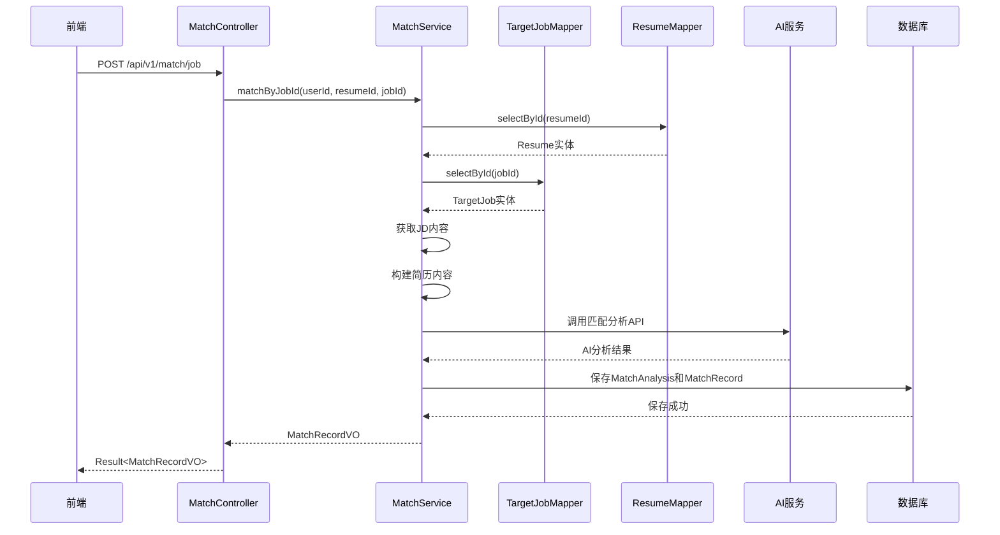

# 简历分析模块新增选择岗位功能详细设计

## 1. 添加原因

### 1.1 背景
简历分析模块（Match模块）在 sprint1 阶段实现，当时岗位管理模块（Job模块）尚未开发。因此，匹配分析只能通过用户手动输入岗位JD文本（`POST /api/v1/match/jd`）来完成。

### 1.2 问题
- 用户需要手动复制粘贴岗位JD内容，操作繁琐
- 用户在岗位管理模块中已有保存的岗位信息，但无法直接关联使用
- 无法追踪匹配记录与岗位的关联关系

### 1.3 解决方案
新增一个接口，允许用户直接选择已保存的岗位进行匹配分析，系统自动获取该岗位的JD内容进行分析。

## 2. 接口设计

### 2.1 新增接口

| 属性 | 值 |
| :--- | :--- |
| **接口路径** | `POST /api/v1/match/job` |
| **HTTP方法** | POST |
| **功能描述** | 通过选择岗位ID进行简历匹配分析 |
| **限流配置** | key="match", maxCount=20, duration=60 |

### 2.2 请求参数

**请求体 JSON 结构：**

| 字段名 | 类型 | 必填 | 说明 |
| :--- | :--- | :--- | :--- |
| `resumeId` | Long | 是 | 简历ID |
| `jobId` | Long | 是 | 岗位ID（来自 target_jobs 表） |

**请求示例：**
```json
{
    "resumeId": 1,
    "jobId": 2
}
```

### 2.3 响应参数

| 字段名 | 类型 | 说明 |
| :--- | :--- | :--- |
| `code` | Integer | 响应码（0表示成功） |
| `message` | String | 响应消息 |
| `data` | Object | 匹配记录详情 |

**data 对象结构：**

| 字段名 | 类型 | 说明 |
| :--- | :--- | :--- |
| `id` | Long | 匹配记录ID |
| `resumeId` | Long | 简历ID |
| `jobId` | Long | 岗位ID（新增） |
| `matchScore` | Integer | 匹配分数 |
| `summaryScore` | Integer | 综合评分 |
| `educationScore` | Integer | 教育背景评分 |
| `experienceScore` | Integer | 工作经验评分 |
| `skillScore` | Integer | 技能评分 |
| `projectScore` | Integer | 项目经验评分 |
| `analysisId` | Long | 分析结果ID |
| `analysis` | String | 分析摘要 |
| `createdAt` | String | 创建时间 |

**成功响应示例：**
```json
{
    "code": 0,
    "message": "success",
    "data": {
        "id": 1,
        "resumeId": 1,
        "jobId": 2,
        "matchScore": 85,
        "summaryScore": 90,
        "educationScore": 80,
        "experienceScore": 85,
        "skillScore": 90,
        "projectScore": 80,
        "analysisId": 1,
        "analysis": "综合匹配度较高，建议重点突出项目经验...",
        "createdAt": "2026-07-13 10:30:00"
    }
}
```

### 2.4 错误响应

| HTTP状态码 | code | 说明 |
| :--- | :--- | :--- |
| 400 | 400 | 请选择简历 / 请选择岗位 / 岗位JD内容为空 |
| 403 | 403 | 无权访问该岗位 |
| 404 | 404 | 简历不存在 / 岗位不存在 |
| 500 | 500 | 未配置DASHSCOPE_API_KEY / 匹配分析服务异常 |

## 3. 数据模型变更

### 3.1 MatchRecord 实体新增字段

| 字段名 | 类型 | 说明 |
| :--- | :--- | :--- |
| `jobId` | Long | 岗位ID，可为空（兼容旧数据） |

### 3.2 MatchAnalysis 实体字段复用

`jobDescriptionId` 字段已存在，用于关联岗位描述ID。

## 4. 业务流程



## 5. 代码实现计划

### 5.1 Controller层

在 `MatchController` 中新增接口：
- 路径：`POST /api/v1/match/job`
- 调用 `MatchService.matchByJobId()` 方法

### 5.2 Service层

在 `MatchService` 中新增方法：
- `matchByJobId(Long userId, Long resumeId, Long jobId)`
- 从 `TargetJobMapper` 查询岗位信息
- 校验岗位权限（当前用户是否有权访问该岗位）
- 获取JD内容后调用现有匹配逻辑

### 5.3 DTO层

新增 `MatchJobRequest` DTO：
- 字段：`resumeId`, `jobId`

### 5.4 Entity层

在 `MatchRecord` 实体中新增字段：
- `jobId`（Long类型）

## 6. 权限校验说明

- 用户可以使用任意已存在的岗位进行匹配分析（包括自己创建的、通过fork获取的以及公共社区岗位）
- 岗位仅需存在即可使用，无需进行用户所有权校验
