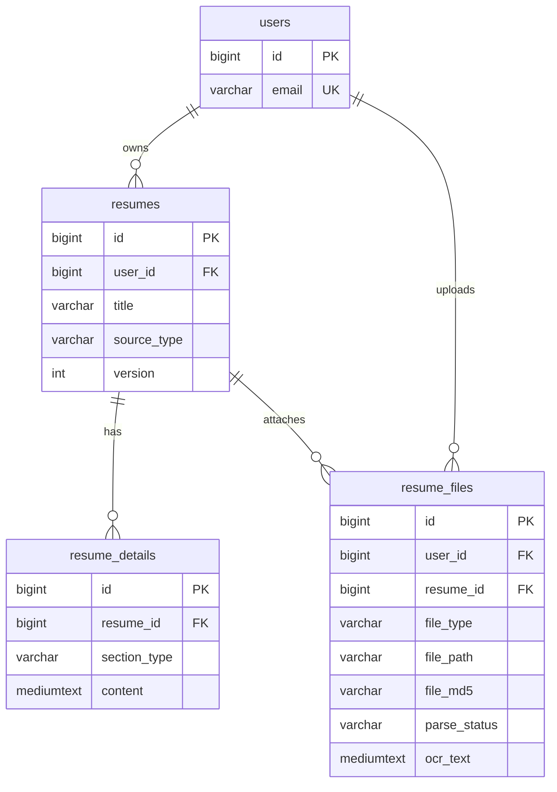

# 简历导入导出模块 — 数据库设计文档

> **版本**：V5（2026-07）  
> **依据**：`server/src/main/resources/db/migration/V1__init.sql` → `V4__resume_schema_stitch.sql` → `V5__normalize_resume_storage.sql`  
> **代码**：`Resume.java` / `ResumeDetail.java` / `ResumeFile.java` / `ResumeService.java`

---

## 1. 模块范围

本模块涉及的数据库表：

| 表名 | 角色 |
|------|------|
| `users` | 用户归属（外键依赖，非本模块维护） |
| `resumes` | 简历元数据（标题、来源、版本） |
| `resume_details` | 可编辑正文与各分段 |
| `resume_files` | 上传原文件、解析/OCR 文本、秒传去重 |

**不在本模块范围内**：`analysis_records`（AI 分析，见 `V2__add_analysis_records.sql`）。

---

## 2. 存储模型（V5 核心设计）

V5 将存储职责拆分为三层：

```
┌─────────────────────────────────────────────────────────────┐
│  resumes          元数据：标题、来源、版本                    │
├─────────────────────────────────────────────────────────────┤
│  resume_details   正文：SUMMARY=全文；其他=结构化分段        │
├─────────────────────────────────────────────────────────────┤
│  resume_files     原文件路径 + 解析/OCR 文本 + 解析状态      │
└─────────────────────────────────────────────────────────────┘
         磁盘文件（uploads/resumes/）← file_path 指向
```

| 数据 | 存放位置 | 说明 |
|------|----------|------|
| 简历标题、来源、版本 | `resumes` | 不再存 `content`（V5 已删除） |
| 导入/OCR/编辑后的全文 | `resume_details`（`section_type = SUMMARY`） | 导出 PDF/DOCX 读此字段 |
| 原始上传文件信息 | `resume_files` | 含 MD5、解析状态、OCR 文本 |
| 物理文件 | 磁盘 `uploads/resumes/` | 不入库，由 `file_path` 关联 |

---

## 3. ER 关系图



---

## 4. 表结构详细设计

### 4.1 `resumes` — 简历主表

仅存元数据，**不存正文**。

| 字段 | 类型 | 约束 | 说明 |
|------|------|------|------|
| `id` | BIGINT UNSIGNED | PK, AUTO_INCREMENT | 简历 ID |
| `user_id` | BIGINT UNSIGNED | NOT NULL, FK → `users.id` | 所属用户 |
| `title` | VARCHAR(255) | NOT NULL, DEFAULT `'未命名简历'` | 标题；导入时取文件名（去扩展名） |
| `source_type` | VARCHAR(16) | NOT NULL, DEFAULT `'MANUAL'` | 来源枚举（V4 新增） |
| `version` | INT UNSIGNED | NOT NULL, DEFAULT 1 | 版本号；每次保存 +1 |
| `created_at` | DATETIME | NOT NULL, DEFAULT CURRENT_TIMESTAMP | 创建时间 |
| `updated_at` | DATETIME | NOT NULL, ON UPDATE CURRENT_TIMESTAMP | 更新时间 |

**`source_type` 枚举（代码常量）：**

| 值 | 含义 | 写入时机 |
|----|------|----------|
| `MANUAL` | 在线新建 | `createResume()` |
| `IMPORT` | 文件导入 | `buildImportResult()` |

**索引与外键：**

- `idx_user_id(user_id)`
- `fk_resumes_user` → `users(id)` ON DELETE **CASCADE**

**代码映射：** `Resume.java` · `ResumeMapper.java`

---

### 4.2 `resume_details` — 简历明细表

| 字段 | 类型 | 约束 | 说明 |
|------|------|------|------|
| `id` | BIGINT UNSIGNED | PK, AUTO_INCREMENT | 明细 ID |
| `resume_id` | BIGINT UNSIGNED | NOT NULL, FK → `resumes.id` | 所属简历 |
| `section_type` | VARCHAR(32) | NOT NULL | 分段类型 |
| `section_name` | VARCHAR(64) | NOT NULL | 分段标题 |
| `content` | **MEDIUMTEXT** | NOT NULL | 分段正文（V5 由 TEXT 升级） |
| `sort_order` | INT UNSIGNED | NOT NULL, DEFAULT 0 | 排序 |
| `created_at` | DATETIME | NOT NULL, DEFAULT CURRENT_TIMESTAMP | 创建时间 |
| `updated_at` | DATETIME | NOT NULL, ON UPDATE CURRENT_TIMESTAMP | 更新时间 |

**`section_type` 枚举：**

| 值 | 用途 | 导入导出模块 |
|----|------|--------------|
| `SUMMARY` | 简历全文 | **核心**：导入/OCR 结果、手动编辑、导出源 |
| `EDUCATION` | 教育经历 | 分段 CRUD（后续结构化） |
| `WORK_EXPERIENCE` | 工作经历 | 同上 |
| `PROJECT` | 项目经验 | 同上 |
| `SKILL` | 技能 | 同上 |

**导入模块约定：**

- 一键导入（`POST /import`）只写一条 `SUMMARY`，`section_name = '正文'`，`sort_order = 0`
- `saveSummaryContent()`：有则更新，无则插入（幂等）
- 列表预览：取 `SUMMARY` 前 200 字（`previewSummary()`）

**索引与外键：**

- `idx_resume_id(resume_id)`
- `fk_details_resume` → `resumes(id)` ON DELETE **CASCADE**

**代码映射：** `ResumeDetail.java` · `ResumeDetailMapper.java`

---

### 4.3 `resume_files` — 简历文件表

| 字段 | 类型 | 约束 | 说明 |
|------|------|------|------|
| `id` | BIGINT UNSIGNED | PK, AUTO_INCREMENT | 文件 ID |
| `user_id` | BIGINT UNSIGNED | NOT NULL, FK → `users.id` | 上传用户 |
| `resume_id` | BIGINT UNSIGNED | NULL, FK → `resumes.id` | 关联简历；导入后必填 |
| `file_type` | VARCHAR(32) | NOT NULL | 文件类型枚举 |
| `file_path` | VARCHAR(512) | NOT NULL | 磁盘相对路径（UUID 文件名） |
| `file_size` | BIGINT UNSIGNED | NOT NULL, DEFAULT 0 | 字节数 |
| `file_md5` | VARCHAR(32) | NULL | MD5，秒传去重（V4 新增） |
| `original_name` | VARCHAR(255) | NOT NULL | 原始文件名 |
| `ocr_text` | **MEDIUMTEXT** | NULL | 解析/OCR 文本（V5 升级） |
| `parse_status` | VARCHAR(16) | NOT NULL, DEFAULT `'PENDING'` | 解析状态（V5 新增） |
| `created_at` | DATETIME | NOT NULL, DEFAULT CURRENT_TIMESTAMP | 上传时间 |

**`file_type` 枚举（`FileParseService.detectType()`）：**

| 值 | 扩展名 | 解析方式 |
|----|--------|----------|
| `PDF` | `.pdf` | PDFBox 抽文本 |
| `DOCX` | `.docx` | POI 抽文本 |
| `DOC` | `.doc` | POI 抽文本 |
| `JPG` / `JPEG` | `.jpg` `.jpeg` | OCR |
| `PNG` | `.png` | OCR |

**`parse_status` 枚举：**

| 值 | 含义 | 写入时机 |
|----|------|----------|
| `PENDING` | 待解析 | 单独上传文件 `uploadFile()` |
| `DONE` | 成功 | 导入/OCR/解析成功 |
| `FAILED` | 失败 | PDF/Word 解析为空 |
| `OCR_FALLBACK` | OCR 降级 | OCR 返回占位/失败文本 |

**索引与外键：**

- `idx_user_id(user_id)`
- `idx_resume_id(resume_id)`
- `idx_user_md5(user_id, file_md5)` — 秒传查询
- `fk_files_user` → `users(id)` ON DELETE **CASCADE**
- `fk_files_resume` → `resumes(id)` ON DELETE **SET NULL**

**代码映射：** `ResumeFile.java` · `ResumeFileMapper.java`

---

### 4.4 `users` — 用户表（依赖）

导入导出通过 `user_id` 做数据隔离，表结构见 `V1__init.sql`，本模块不直接修改。

---

## 5. 业务流程与数据落库

### 5.1 一键导入（`POST /api/v1/resumes/import`）

```
用户上传文件
    ↓
计算 MD5 → 查 resume_files(user_id, file_md5) 秒传
    ↓
未命中 → 存盘 uploads/resumes/{uuid}
    ↓
按类型解析：
  · PDF/DOC/DOCX → FileParseService → 文本
  · JPG/PNG      → OcrService       → 文本
    ↓
INSERT resumes (source_type=IMPORT, title=文件名)
INSERT resume_details (SUMMARY, content=文本)
INSERT resume_files (ocr_text, parse_status, file_md5, ...)
```

单事务内写入 3 张表，返回 `ImportResultVO`（`resumeId`, `content`, `fileId`, `parseStatus`）。

### 5.2 分片上传（大文件）

```
POST /upload/chunk  → 临时目录 chunks（不入库）
POST /upload/merge  → 合并文件 → 同 buildImportResult() 落库
```

### 5.3 单独上传 + 后处理

| 接口 | 数据库操作 |
|------|------------|
| `POST /{resumeId}/files` | INSERT `resume_files`，`parse_status=PENDING` |
| `POST /files/{fileId}/extract` | UPDATE `ocr_text`, `parse_status`；同步 `resume_details.SUMMARY` |
| `POST /files/{fileId}/ocr` | 同上（仅 JPG/PNG） |

`syncSummaryFromFile()`：OCR/解析成功后更新 `SUMMARY`，`resumes.version + 1`。

### 5.4 导出（`GET /{id}/export/pdf|docx|text`）

```
SELECT resume_details WHERE section_type='SUMMARY'
    ↓
ResumeExportService 生成字节流（不写库）
```

导出只读 `resume_details`，不读 `resume_files`。

### 5.5 删除简历（`DELETE /{id}`）

```
DELETE 磁盘文件（resume_files.file_path）
DELETE resume_details
DELETE resume_files
DELETE resumes
```

---

## 6. 秒传去重设计

| 项目 | 设计 |
|------|------|
| 哈希算法 | MD5（`ChunkUploadService.md5()`） |
| 查重范围 | 同一 `user_id` 下 |
| 查重表 | `resume_files.file_md5` |
| 索引 | `idx_user_md5(user_id, file_md5)` |
| 命中行为 | 复用已有 `file_path`，不重复写盘 |

---

## 7. 文件存储（与数据库配合）

| 配置项 | 默认值 | 配置类 |
|--------|--------|--------|
| 上传目录 | `uploads/resumes/` | `StorageProperties.uploadDir` |
| 分片目录 | `uploads/resumes/chunks/` | `StorageProperties.chunkDir` |
| 大小上限 | 100MB | `StorageProperties.maxFileSize` |

`resume_files.file_path` 存 UUID 文件名；`original_name` 保留用户原始名。

---

## 8. Flyway 迁移历史

| 版本 | 脚本 | 导入导出相关变更 |
|------|------|------------------|
| V1 | `V1__init.sql` | 创建 4 张基础表 |
| V4 | `V4__resume_schema_stitch.sql` | 幂等添加 `source_type`、`file_md5` |
| V5 | `V5__normalize_resume_storage.sql` | 添加 `parse_status`；`content`/`ocr_text` → MEDIUMTEXT；迁移并删除 `resumes.content` |

**V5 数据迁移逻辑：**

- 若 `resumes.content` 存在且非空 → 写入 `resume_details(SUMMARY)` → 删除 `content` 列

---

## 9. 实体与 Mapper 对照

```
server/src/main/java/com/resume/module/resume/
├── entity/
│   ├── Resume.java         → resumes
│   ├── ResumeDetail.java   → resume_details
│   └── ResumeFile.java     → resume_files
└── mapper/
    ├── ResumeMapper.java
    ├── ResumeDetailMapper.java
    └── ResumeFileMapper.java
```

---

## 10. 示例数据（导入 PNG 后）

**resumes：**

```
id=12, user_id=1, title='简历2', source_type='IMPORT', version=1
```

**resume_details：**

```
resume_id=12, section_type='SUMMARY', section_name='正文',
content='（OCR 识别出的全文）', sort_order=0
```

**resume_files：**

```
user_id=1, resume_id=12, file_type='PNG',
file_path='a1b2c3....png', file_md5='d41d8cd9...',
ocr_text='（同上）', parse_status='DONE'
```
